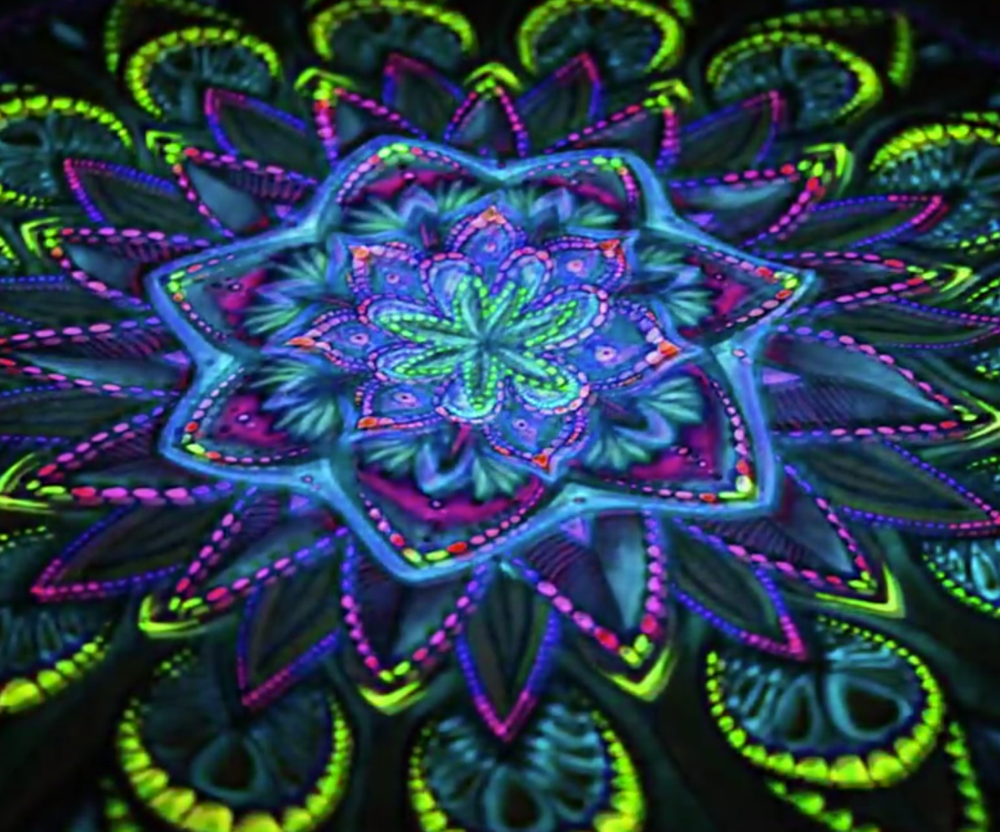

# Readme:

## How to interact

1. After loading successfully, the pattern of all mushrooms will have different animation effects according to different situations:

   - Randomly generated patterns:

     For randomly generated pattern styles such as Nest, Mono, Multiple in Cap Pattern, I added a **flashing change effect**.

   - Regular layout patterns:

     For the regular patterns like Dot Track in the Base Parts or Stem part, I added a **flow effect** from top to bottom.

   - Patterns generated by voronoi method:

     For the texture generated by voronoi technology in Stem, I added a **color gradient** effect.

2. Move the mouse and clicks the mushroom, it starts pulsing bigger and smaller. Clicking it again will stop the animation.


## Detailed information

Because the mushrooms we simulated visually use bright and uncommon color colors, with various patterns. In our understanding, mushrooms of this color and pattern are often inedible. Once eaten, we will be poisoned and hallucinations. It reminds me that if someone accidentally eats or touches this mushroom, they may have a visual experience similar to **hallucinations or psychedelic**. 
After communicating with other group members, I found that their design focus were basically on the background and the size of the mushroom (without input interaction). So, I want to pay my attention to the **pattern of the mushroom**. I want to achieve effects such as color-shifting (Effect Index, n.d.).

When designing animation, I want to make the pattern or color on the surface of the mushroom into a slightly moving and flickering shape through **random function or Perlin noise**, so as to achieve the effect that the mushroom seems to be breathing.

When the audience tries to observe closely and **click the mouse** to confirm that if it is really moving, the mushroom will further produce **changes in magnification and reduction**, simulating visual effects similar to respiratory hallucinations to enhance their experience.


## Technical explanation

### Animation 1: 

#### Idea: 

I removed noLoop() in draw() to let the frames update continuously. Then I added time-based logic to the small mushroom patterns and used a pulsing state for the big mushroom by passing time into drawCapReplica and drawStemUniform. Then I can add some animation.

```
let bigMushroom = {
  isPulsing: false,
  pulseScale: 1,
  pulseSpeed: 0.05,
  phase: 0,
  minScale: 0.92,
  maxScale: 1.08,
  flowTime: 0  
};
```

#### Implementation:

##### 1. **Cap**:

**1.1 large mushroom**

Randomness was achieved by random() to make a time-varying visual output that exhibits a blinking effect.

```
  random(26, 44) + sin(frameCount * 0.5 + i) * (2 + random(-1, 1)),
  random(16, 26) + sin(frameCount * 0.5 + i) * (2 + random(-1, 1))
```

**1.2  small mushroom**

Cap with Nested &Mono & Mult & Noisy Rings pattern

For the circle patterns (Mono & Mult) and the Nested pattern, I used random() to add  variation, while Noisy Rings pattern is driven by noise-based continuous oscillation, resulting in an organic breathing animation. 

```
let r = random(minR, maxR);
fill(random([accent1, accent2]));
circle(c.x, c.y, 2 * r);
```

```
let n = noise(noiseBase + cos(th)*noiseFreq, noiseBase + sin(th)*noiseFreq);
let d = map(n, 0, 1, minD, maxD);
circle(x, y, d);
```

##### 2. **Stem**:

**2.1 large mushroom & dot track pattern for small mushrooms**

For the large mushroom, inside the stemDotTrack function, I introduced a timeOffset applied to the parameter v to create a looping downward flow. The % 1 operation keeps v within the [0, 1) range, so when the dots reach the bottom, they reappear from the top, resulting in a continuous cycle. A similar approach is also applied to the small mushrooms. In addition to flowing downward, I added Perlin noise to slightly disturb the vertical position of each dot in small mushroom, so that the movement appears smoother and more natural.

```
let v = (v0 + time * flowSpeed) % 1;
```

```
let noiseShake = opt.noiseShake ?? height * 0.03;
let n = noise(k * 0.15, i * 0.15, frameCount * 0.02);
let y = bb.miny + yWrapped + map(n, 0, 1, -noiseShake, noiseShake); 
```

**2.2 small mushroom: dot_gradient**

By adding time and noise as animation drivers, I want to produce a subtle “breathing-like” motion in the final visual output. So the circle scale should vary within [1 − amp, 1 + amp].

```
  let tt    = opt.time != null ? opt.time : frameCount * 0.1; 
  let amp  = opt.noiseAmp != null ? opt.noiseAmp : 0.5;      
  let freq = opt.noiseFreq != null ? opt.noiseFreq : 0.1;    
  ...
  let n = noise(x * freq, y * freq, tt);
  let s = 1 + amp * (n * 2 - 1);  // vary in [1 - amp, 1 + amp]
  circle(x, y, r * 2 * s);
```

**2.3 small mushroom: voronoi_cells**

Using Perlin noise to generate smooth color variations, creating a natural breathing-like visual effect.

```
let n = noise(site.x * noiseFreq, site.y * noiseFreq); // noise value to vary color slightly
let s = baseS + (n - 0.5) * satRange;
let b = baseB + (n - 0.5) * briRange;
```

##### 3 **Basepart**:

**3.1 large mushroom**

By using the time-based value tMove to change the radius of each ring, the dots keep moving along the radius in a loop, which creates a slow flowing effect towards the center of the mushroom cap.

```
let t0 = r / (rings - 1);
let tMove = (t0 - time * 0.08) % 1;
if (tMove < 0) tMove += 1;
let rr = lerp(H * 0.2, H * 1.6, tMove);
```

**3.2 small mushroom: tracks_mono & tracks_alt**

The logic of adding animation to the base part of the small mushroom is quite similar to the animation applied to the stem of the large mushroom.

```
let scaleAnim = 1 + sin(frameCount * 0.02) * 0.1;
let diameter = circleDiameter * scaleAnim;
circle(x, y, diameter);
```


### Animation 2: 

#### Idea: 

The large mushroom uses a click-to-toggle time-based animation system.Once the user clicks on the cap or stem area, the mushroom begins to animate, and clicking again will stop the animation by freezing its time and scale values.

#### Implementation:

**1. Large mushroom**

To support the click-to-toggle interaction, I added a mousePressed() function that checks whether the mouse click happens inside the cap or stem area. For the large mushroom,if the click is valid, the isPulsing state would switch between true and false.

```
//large mushroom
function mousePressed() {
  // Convert screen coordinates into design space
  const sx = width  / DESIGN_W;
  const sy = height / DESIGN_H;
  const s  = min(sx, sy);
  const mx = (mouseX - (width - DESIGN_W * s) / 2) / s;
  const my = (mouseY - (height - DESIGN_H * s) / 2) / s;

  // Bounding boxes for large mushroom cap + stem
  const cx = DESIGN_W * 0.35;
  const cy = DESIGN_H * 0.75;

  const inCap =
    mx >= cx - 420 && mx <= cx + 420 &&
    my >= cy - 880 && my <= cy - 520;

  const inStem =
    mx >= cx - 140 && mx <= cx + 140 &&
    my >= cy - 700 && my <= cy + 40;

  // Toggle animation state
  if (inCap || inStem) {
    bigMushroom.isPulsing = !bigMushroom.isPulsing;
  }
}

```

**2. Small mushroom**

For the small mushroom, I looped through all the small mushrooms and convert the mouse position into each mushroom’s local coordinate system. Then, I used their own bounding boxes to check the collision. If a hit is detected, the isPulsing state would be switched.

```
//small mushroom
for (let m of mushrooms) {
  // Convert mouse position to mushroom local coordinates
  let lx = mx - m.anchor.x;
  let ly = my - m.anchor.y;

  // Undo rotation
  if (m.rot) {
    let cosA = cos(-m.rot);
    let sinA = sin(-m.rot);
    let rx = lx * cosA - ly * sinA;
    let ry = lx * sinA + ly * cosA;
    lx = rx;
    ly = ry;
  }

  // Undo scaling
  lx /= m.scale;
  ly /= m.scale;

  // Collect cap / stem / base bounding boxes
  let boxes = [];
  if (m.cap?.bounds) boxes.push(m.cap.bounds);
  if (m.stem?.bounds) boxes.push(m.stem.bounds);
  if (m.basePart?.bounds) boxes.push(m.basePart.bounds);

  // Hit test
  let hit = false;
  for (let bb of boxes) {
    if (lx >= bb.x && lx <= bb.x + bb.w &&
        ly >= bb.y && ly <= bb.y + bb.h) {
      hit = true;
      break;
    }
  }

  // Toggle animation state
  if (hit) {
    m.isPulsing = !m.isPulsing;
    break;
  }
}
```

## Reference

Effect Index. (n.d.). Colour shifting. Effect Index. https://www.effectindex.com/effects/colour-shifting


## Appendix
I acknowledge the use of Microsoft Copilot to make edits on the content of this readme, including grammatical checks, tone and style adjustment and text simplification.


